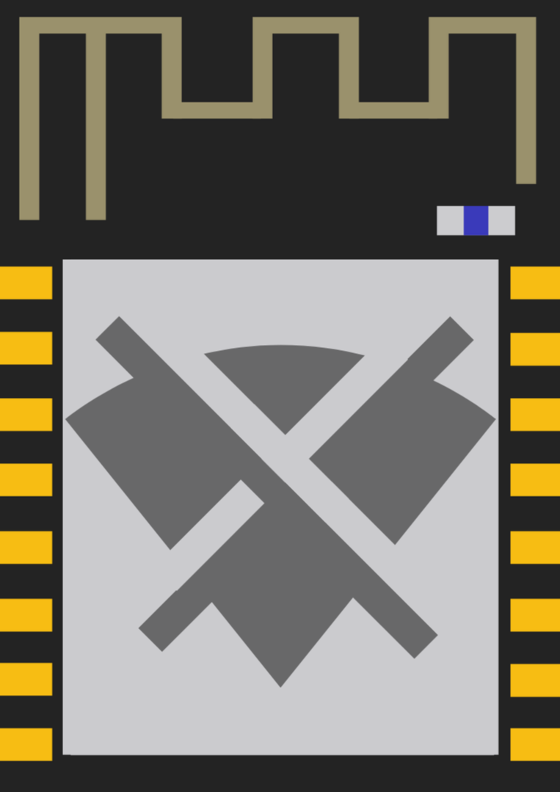

# AsungX

<p align="center">
  
</p>

AsungX adalah firmware ESP8266 untuk pembelajaran dan pengujian keamanan Wi-Fi secara terkendali. Proyek ini menyediakan antarmuka web dan layar perangkat untuk membantu memeriksa jaringan yang Anda miliki atau yang penggunaannya telah mendapat izin.

## Penggunaan yang Bertanggung Jawab

Gunakan perangkat hanya pada jaringan dan perangkat milik sendiri atau dengan izin tertulis dari pemiliknya. Pengujian dapat mengganggu konektivitas perangkat lain. Patuhi hukum dan peraturan setempat. Pengembang tidak bertanggung jawab atas penyalahgunaan atau kerusakan yang timbul dari penggunaan perangkat lunak ini.

## Persiapan

- Perangkat ESP8266 yang didukung oleh paket board DeautherX.
- Arduino IDE atau Arduino CLI.
- Kabel USB data yang sesuai dengan board.

Untuk Arduino IDE, tambahkan URL berikut pada **Preferences → Additional Boards Manager URLs**:

```text
https://raw.githubusercontent.com/BlackTechX011/arduino/main/package_BlackTechX_index.json
```

Kemudian pasang paket board **DeautherX ESP8266** melalui Boards Manager. Nama paket tersebut dipertahankan sesuai nama yang diterbitkan upstream.

## Kompilasi

Buka folder `AsungX` dan pilih `AsungX.ino` di Arduino IDE, lalu pilih board ESP8266 yang sesuai dan kompilasi.

Dengan Arduino CLI dan board NodeMCU:

```sh
arduino-cli compile --fqbn deauther:esp8266:nodemcuv2 AsungX
```

Untuk board lain, gunakan FQBN yang sesuai dengan perangkat Anda.

## Struktur Proyek

- `AsungX/` berisi sketch firmware dan dependensi yang digunakan saat kompilasi.
- `web_interface/` berisi sumber antarmuka web.
- `EvilTwin/` berisi halaman portal uji yang dapat disesuaikan untuk lingkungan pengujian berizin.
- `LICENSE.txt` memuat ketentuan lisensi proyek.

## Atribusi, Copyright, dan Lisensi

Proyek ini berasal dari **DeautherX** oleh **BlackTechX**. Hak cipta atas karya asli tetap pada pemegang hak cipta aslinya:

> Copyright (c) 2026 BlackTechX

AsungX memuat perubahan dan rebranding atas karya tersebut:

> Copyright (c) 2026 AsungX Developer

Karya asli dan distribusi turunan ini mengikuti lisensi MIT sebagaimana tercantum dalam [`LICENSE.txt`](LICENSE.txt). Tautan proyek upstream: [BlackTechX011/DeautherX](https://github.com/BlackTechX011/DeautherX).

Terima kasih kepada para kontributor proyek asli, termasuk DX4GREY.
<div align="center">

  
  <h1>AsungX</h1>

  <p>
    An open-source ESP8266_Deauther with customizable Evil Twin attack, and WiFi signal strength checker, with a user-friendly web interface and Display interface and more.
  </p>

  <!-- Badges -->
  <p>
    <a href="https://github.com/BlackTechX011/DeautherX" title="Go to GitHub repo"></a>
    <a href="https://github.com/BlackTechX011/DeautherX"></a>
    <a href="https://github.com/BlackTechX011/DeautherX"></a>
  </p>

  <h4>
    <a href="https://www.GitHub.com/BlackTechX011/">GITHUB</a>
    <span> · </span>
    <a href="https://www.instagram.com/BlackTechX011/">INSTAGRAM</a>
    <span> · </span>
    <a href="https://www.youtube.com/@BlackTechX_">YOUTUBE</a>
  </h4>
</div>

<br />

<!-- Table of Contents -->
# :notebook_with_decorative_cover: Table of Contents

- [About the Project](#star2-about-the-project)
- [Documentation](#books-documentation)
- [Password](#lock-password)
- [Automatic Installation](#rocket-automatic-installation)
- [Installation with Arduino IDE](#wrench-installation-with-arduino-ide)
- [Disclaimer](#warning-disclaimer)
- [Special Thanks](#sparkles-special-thanks)
- [Feedback](#wave-feedback)

<!-- About the Project -->
## :star2: About the Project

This firmware allows you to easily perform a variety of actions to test 802.11 networks using an ESP8266. It's also a great project for learning about WiFi, microcontrollers, Arduino, hacking, and electronics/programming in general.

The deauthentication attack is the main feature, which can be used to disconnect devices from their WiFi network.
Although this denial-of-service attack is nothing new, a lot of devices are still vulnerable to it. Luckily, this is slowly changing with more WiFi 6-enabled devices being used. But a lot of outdated WiFi devices remain in place, for example in cheap IoT hardware. With an ESP8266 Deauther, you can easily test this attack on your 2.4GHz WiFi network/devices and see whether it's successful or not. And if it is, you know you should upgrade your network.

To know more about deauthentication, visit [WiFi Deauthentication Frame Explained](https://blog-blacktechx.hashnode.dev/wifi-deauthentication-frame-explained).

<!-- Documentation -->
## :books: Documentation

Please visit the [AsungX docs](https://blacktechx011.github.io/DeautherX_Docs/) for detailed information about this project. Here is quick link:
- [Home](https://blacktechx011.github.io/DeautherX_Docs/)
```
https://blacktechx011.github.io/DeautherX_Docs/
```


<!-- Password -->
## :lock: Password

The password for `AsungX` is `BlackTechX`.

<!-- Automatic Installation -->
## :rocket: Automatic Installation

### [Video Tutorial](https://www.youtube.com/watch?v=qQUHb2XycNw)

1. Visit [AsungX Web Tools](https://blacktechx011.github.io/DeautherX_Web_Tools/).
2. Select your ESP8266 board.
3. Select display type.
4. Connect your ESP8266 board via USB.
5. Click Connect and select the serial port of your ESP.
6. On the Device Dashboard, click on install.

<!-- Installation with Arduino IDE -->
## :wrench: Installation with Arduino IDE

1. Install the [Arduino IDE](https://www.arduino.cc/en/Main/Software).
2. Go to **File** -> **Preferences** -> **Additional Boards Manager URLs** and add:  
   `https://raw.githubusercontent.com/BlackTechX011/arduino/main/package_BlackTechX_index.json`
3. Go to `Tools` -> `Board` -> `Boards Manager` and install `DeautherX ESP8266`.
4. Open the AsungX code folder.
5. Open `AsungX.ino` with Arduino IDE.
6. Select the port.
7. Go to `Tools` -> `Board` -> `Boards Manager` and select your AsungX board from `DeautherX ESP8266 boards`.
8. Click on upload.

<!-- Disclaimer -->
## :warning: Disclaimer

This project is a proof of concept for testing and educational purposes.
Neither the ESP8266 nor its SDK was meant or built for such purposes. Bugs can occur!

Use it only against your own networks and devices!
Please check the legal regulations in your country before using it.
We don't take any responsibility for what you do with this program.

For more information, visit [AsungX on Hashnode](https://blog-blacktechx.hashnode.dev/deautherx).

<!-- Special Thanks -->
## :sparkles: Special Thanks

Special thanks to DX4GREY for their contributions.
- GitHub Profile: [DX4GREY](https://github.com/DX4GREY/)

<!-- Feedback -->
## :wave: Feedback

If you have any feedback or queries, please create an issue on this repository.
